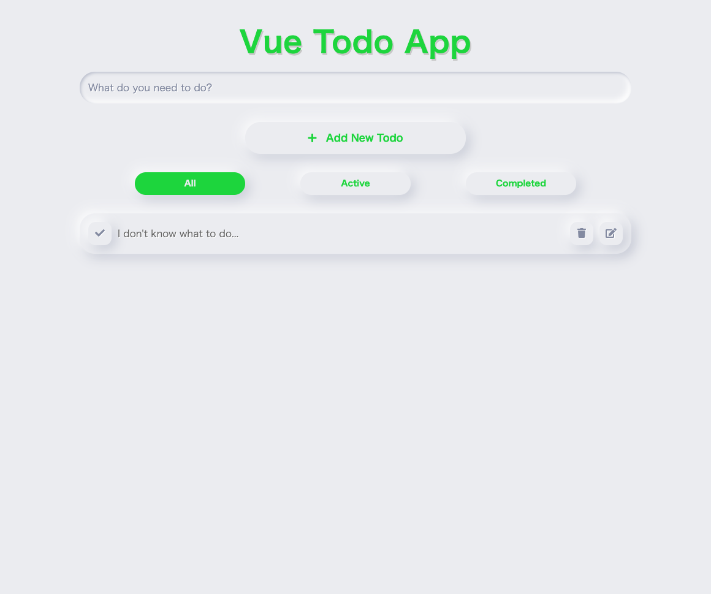

# Vue Todo App

This is a simple todo app with vue.js.

Check it out [here](https://taku0823.github.io/vue-todo-app/)

## Getting Started

1. Clone the project
2. Install dependencies in CLI with `npm install`
3. In CLI run `npm start`